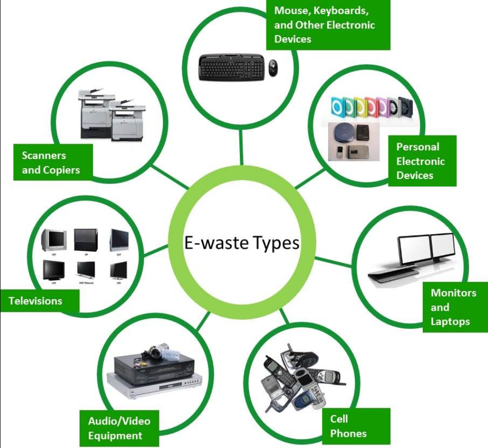
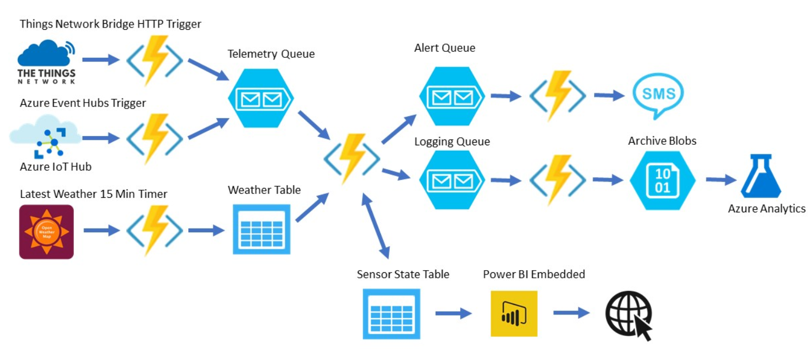

# Smart India Hackathon Workshop
# Date:18/05/2024
## Register Number:212223240015
## Name:Arshitha MS
## Problem Title
E-Waste Facility Locator
## Problem Description
Website that tells you the location of the nearest e-waste collection and recycling facility. Offers educational pop-ups on the harmful components of your e-waste and their effects on the environment and human health if not disposed correctly. There could be an option to input the model of your old device and earn credit points relative to the amount of precious metals recovered from the device if disposed correctly.
## Problem Creater's Organization
Ministry of Environment

## Idea
The main idea of the problem statement is to develop a user-friendly website that helps people locate the nearest e-waste collection and recycling facilities. The website should also provide educational information about the harmful components of e-waste and the environmental and health risks associated with improper disposal. Additionally, the site should allow users to enter the model of their old electronic devices to estimate and earn credit points based on the precious metals that can be recovered from these devices when disposed of correctly. This solution aims to promote proper e-waste disposal through awareness and incentives.

## Proposed Solution / Architecture Diagram

## Use Cases
#### 1.Locate E-Waste Facility:

Actor: User
Description: User enters their location or allows access to their geolocation to find the nearest e-waste facility.
Preconditions: User has a device with internet access and location services enabled.
Postconditions: User receives a list of nearby facilities with details such as address, contact info, and working hours.
#### 2.Educational Content:

Actor: User
Description: Users receive educational pop-ups while navigating the site, providing information on harmful e-waste components and proper disposal practices.
Preconditions: User interacts with the site.
Postconditions: User is educated on the importance of proper e-waste disposal and its environmental and health impacts.

#### 3.Device Model Input and Credit Points:

Actor: User
Description: Users input their device model to see the potential credit points they can earn by recycling.
Preconditions: User has a device model to input.
Postconditions: User sees the estimated credit points and understands the value of proper e-waste disposal.

## Technology Stack
1.Geocoding API for geographical coordinates

2.PostgreSQL 15.4, MySQL 5.7.43 for database

3.Jupyter Notebook 7.0.3 for image recognition using Tensorflow

## Dependencies
Mapping Services – 10 Days

Data Collection – 15 Days

Estimated Budget – Rs.30,000